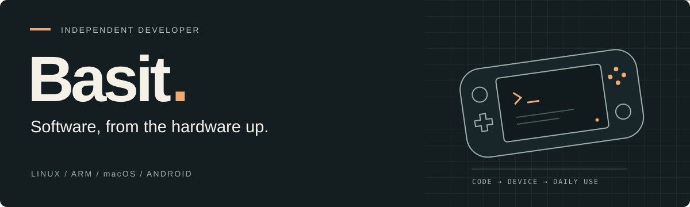

  

I like getting more out of the devices I own. Lately that means SteamOS on ARM handhelds, a Samsung flashing app for Mac, and better controls in Android video players.

Most of my work lives somewhere between Linux, native apps and figuring out how an existing system works.

 

01 / FEATURED PROJECT

## SteamOS on ARM handhelds

**Bringing the Steam Deck experience to Snapdragon hardware.**

I maintain a SteamOS port for the KONKR Pocket FIT, built on Valve’s ARM image and ROCKNIX device support. It runs Game Mode and KDE, with x86 games through FEX and ARM64 games through Proton.

A lot of the work happens after the first successful boot: tracking down standby drain, getting the fan and CPU scheduling right, keeping the controls working, and building the internal-storage installer and update tools. Those are the details that decide whether a handheld is pleasant to use every day.

Linux · ARM64 · Gamescope · FEX · Proton · Shell · Python

**[Explore the project ↗](https://github.com/hashtagbasit/SteamOS-ARM-Handhelds)** &nbsp; · &nbsp; [Releases](https://github.com/hashtagbasit/SteamOS-ARM-Handhelds/releases) &nbsp; · &nbsp; [How it works](https://github.com/hashtagbasit/SteamOS-ARM-Handhelds/blob/main/docs/HOW-IT-WORKS.md)

Pocket FIT is the main target. Pocket S2 / S2 Pro support is experimental.

 

<table>
<tr>
<td width="50%" valign="top">
02 / NATIVE macOS
<h3><a href="https://github.com/hashtagbasit/valkyrie">Valkyrie ↗</a></h3>

Samsung firmware flashing, in a native Mac app.

Downloads firmware from Samsung, verifies and unpacks it, then flashes over USB using Heimdall. I built the app around the whole process, including live progress, partition mapping and CSC changes.

Swift · SwiftUI · IOKit · USB

<a href="https://github.com/hashtagbasit/valkyrie#screens">See the app</a> · <a href="https://github.com/hashtagbasit/valkyrie#design-notes">Design decisions</a>

</td>
<td width="50%" valign="top">
03 / ANDROID
<h3><a href="https://github.com/hashtagbasit/aimal-patches">Aimal Patches ↗</a></h3>

The player controls I kept reaching for.

Morphe patches for Crunchyroll, HBO Max, Disney+ and Viki: playback speed, aspect ratio, subtitle styling and fixes for foldable screens. The interesting part is finding where each app actually handles playback.

Kotlin · Java · Android · Reverse engineering

<a href="https://github.com/hashtagbasit/aimal-patches#how-it-works">How the patches work</a> · <a href="https://github.com/hashtagbasit/aimal-patches/releases">Releases</a>

</td>
</tr>
</table>

 

### Working together

I’m interested in software engineering roles involving Linux, device software or native apps. If your team works on the things between the hardware and the person using it, I’d like to talk.
